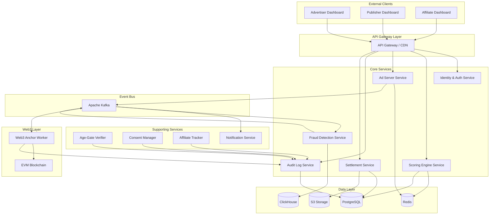
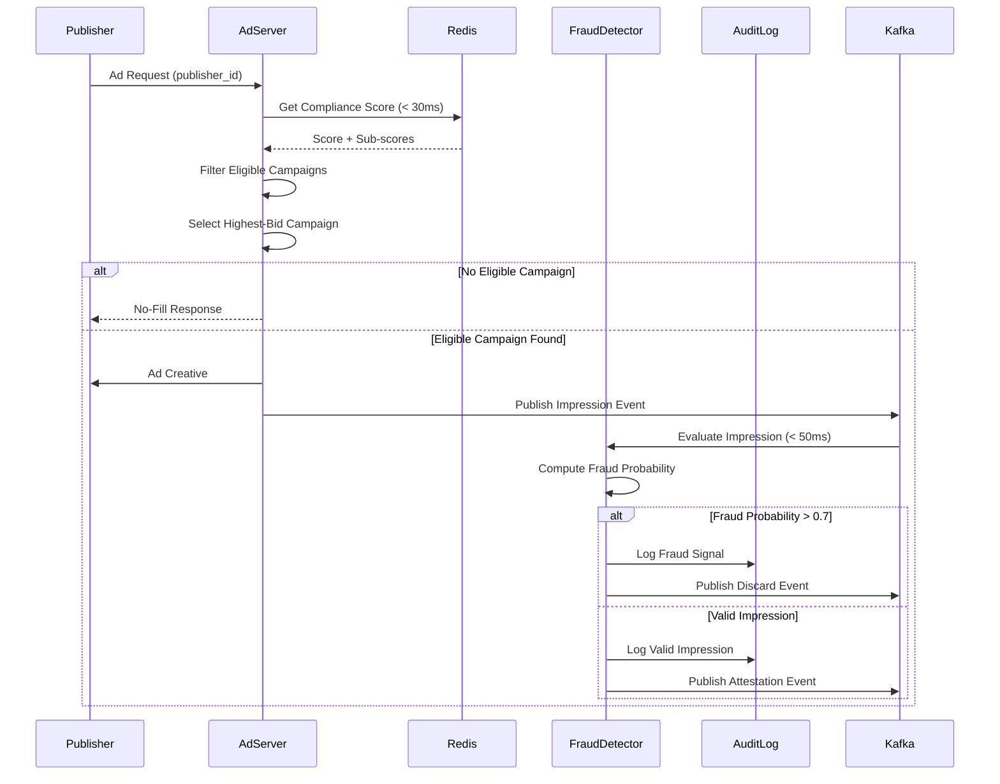

# Design Document: Adult Ad Network with Compliance Scoring

> **Feature:** adult-ad-network-compliance-scoring  
> **Workflow:** requirements-first  
> **Version:** 1.0  
> **Date:** 2025-01-XX

---

## Overview

The Adult Ad Network with Compliance Scoring is a programmatic advertising platform that connects legal adult advertisers with publishers while enforcing multi-dimensional compliance at every layer. The platform's defining capability is a real-time compliance scoring engine that evaluates publishers across four dimensions: age-gate quality, consent-record status, content-category safety, and traffic authenticity.

### Core Value Proposition

- **Brand-safe adult advertising**: Advertisers can set hard compliance requirements (e.g., "only serve ads on publishers with verified age-gates and consent-compliant content") and trust that these requirements are enforced at the moment of ad serving.
- **Transparent settlement**: Campaign billing is based only on valid, non-fraudulent impressions, with cryptographically verifiable traffic attestations.
- **Fail-closed compliance**: If any compliance check cannot complete within its SLA, the ad request is rejected rather than served.
- **Web3 primitives**: Optional on-chain anchoring of traffic attestations and settlement reports provides independent verifiability.

### Key Design Principles

1. **Score-at-serve**: Compliance scores are snapshotted at the exact moment of each impression and embedded in the Traffic Attestation, ensuring billing reflects the compliance state at serving time.
2. **Append-only audit trail**: The Audit Log is a hash-chained ledger where no entry is ever mutated or deleted, providing tamper-evident compliance evidence.
3. **Real-time enforcement**: When a publisher's compliance score drops below a campaign's threshold, ad serving stops within 60 seconds without requiring advertiser intervention.
4. **Fraud-first architecture**: Every impression is evaluated for fraud within 50ms; fraudulent traffic is discarded and excluded from billing before attestation generation.

---

## Architecture

### Service Decomposition

The platform is composed of six bounded services that communicate over internal APIs and an event bus. Each service owns its data store and exposes a versioned REST/gRPC interface.



### Data Flow: Ad Serving Hot Path

The ad serving hot path is optimized for p99 latency < 100ms at 10,000 RPS:



### Event Bus Architecture

The platform uses Apache Kafka as a durable, ordered event log for asynchronous processing:

**Key Topics:**
- `publisher.registered`: Publisher registration events trigger scoring engine assessment
- `score.changed`: Score changes trigger campaign re-evaluation and publisher notifications
- `impression.created`: Impression events trigger fraud evaluation
- `impression.valid`: Valid impressions trigger attestation generation
- `impression.discarded`: Discarded impressions update traffic quality scores
- `consent.expiring`: Consent expiry events trigger publisher notifications
- `agegate.expired`: Age-gate expiry events trigger publisher suspension
- `settlement.generated`: Settlement report events trigger hash anchoring

---

## Components and Interfaces

### 1. Scoring Engine Service

**Responsibility:** Compute and maintain compliance scores for all publishers.

**Core Algorithm:**
```
ComplianceScore = clamp(
  0.30 × AgeGateQuality +
  0.30 × ConsentRecordStatus +
  0.20 × ContentCategorySafety +
  0.20 × TrafficQualityScore,
  0, 100
)
```

**Sub-Score Algorithms:**

**Age_Gate_Quality:**
```
AgeGateQuality = clamp(
  (age_gate_present × 50) +
  (bypass_resistance × 0.40) +
  audit_recency_points,
  0, 100
)

where:
  age_gate_present ∈ {0, 1}
  bypass_resistance ∈ [0, 100]
  audit_recency_points = max(0, 100 - days_since_last_audit / 30)
```

**Consent_Record_Status:**
```
ConsentRecordStatus =
  IF any active consent record is expired or absent THEN 0
  ELSE IF any active consent record expires within 30 days THEN 50
  ELSE 100
```

**Content_Category_Safety:**
```
Four-tier risk taxonomy:
  low-risk → 100
  medium-risk → 66
  high-risk → 33
  prohibited → 0

ContentCategorySafety = min(score(category) for category in declared_categories)
```

**Traffic_Quality_Score:**
```
IF impression_count < 100 THEN
  TrafficQualityScore = 50  // neutral default
ELSE
  discard_rate = discarded_impressions / total_impressions
  TrafficQualityScore = round(100 - (discard_rate × 100))
```

**API Endpoints:**
- `GET /v1/publishers/:id/score` — Retrieve current compliance score (p99 < 200ms)
- `POST /v1/scores/recompute` — Trigger score recomputation (internal)

**Data Store:**
- **PostgreSQL**: Persistent score history, sub-score components
- **Redis**: Hot cache for ad serving lookups (TTL: 5 minutes)

**Event Subscriptions:**
- `publisher.registered` → Compute initial score
- `agegate.verified` → Update Age_Gate_Quality sub-score
- `consent.submitted` → Update Consent_Record_Status sub-score
- `consent.expired` → Update Consent_Record_Status sub-score
- `category.updated` → Update Content_Category_Safety sub-score
- `traffic.quality.updated` → Update Traffic_Quality_Score sub-score

**Event Publications:**
- `score.changed` → Notify campaign manager and publisher dashboard

---

### 2. Ad Server Service

**Responsibility:** Real-time ad selection and serving with compliance enforcement.

**Hot Path Requirements:**
- p99 latency < 100ms at 10,000 RPS
- Fail-closed: no-fill if compliance score unavailable within 30ms
- Score snapshot: capture compliance score at exact moment of serving

**Ad Selection Algorithm:**
```
1. Retrieve publisher's current compliance score from Redis (< 30ms timeout)
2. Filter campaigns where:
   - Campaign is active (not paused, not terminated)
   - Current date within [start_date, end_date]
   - Remaining budget > 0
   - Publisher's compliance_score >= campaign.min_compliance_score
   - Publisher has verified age-gate (if campaign.require_age_gate)
   - Publisher's consent_record_status >= campaign.min_consent_record_status
   - Publisher's declared categories ∩ campaign.blocked_categories = ∅
3. Select campaign with highest bid
4. Tiebreak: earliest creation timestamp
5. If no eligible campaign: return no-fill
6. Serve ad creative
7. Record impression in audit log with score snapshot
8. Publish impression event to Kafka
```

**API Endpoints:**
- `POST /v1/ad-request` — Ad serving endpoint (p99 < 100ms)

**Data Store:**
- **Redis**: Compliance score cache, campaign targeting rules cache

**Event Publications:**
- `impression.created` → Trigger fraud evaluation

---

### 3. Fraud Detection Service

**Responsibility:** Evaluate every impression for fraud within 50ms; fail-closed on timeout.

**Fraud Signals:**
1. **Bot user-agent patterns**: Regex matching against known bot signatures
2. **Datacenter IP ranges**: IP lookup against datacenter CIDR blocks
3. **CTR anomaly**: Click-through rate > 10% over 1-hour rolling window for publisher
4. **Invalid referrer chains**: Referrer domain not in publisher's approved domain list

**Fraud Probability Scoring:**
```
fraud_probability = sigmoid(
  w1 × bot_signal +
  w2 × datacenter_signal +
  w3 × ctr_anomaly_signal +
  w4 × referrer_signal
)

where each signal ∈ {0, 1} and weights sum to 1.0
```

**Discard Logic:**
```
IF fraud_probability > 0.7 OR evaluation_timeout > 50ms THEN
  discard impression
  exclude from billing
  log fraud signal to audit log
ELSE
  mark impression as valid
  generate traffic attestation
```

**API Endpoints:**
- None (Kafka consumer only)

**Data Store:**
- **ClickHouse**: Impression events, rolling aggregates for CTR calculation

**Event Subscriptions:**
- `impression.created` → Evaluate fraud probability

**Event Publications:**
- `impression.valid` → Trigger attestation generation
- `impression.discarded` → Update traffic quality score

---

### 4. Audit Log Service

**Responsibility:** Append-only, hash-chained ledger for compliance-relevant events.

**Hash Chain Algorithm:**
```
entry_hash = SHA256(
  event_type ||
  actor_id ||
  affected_entity_id ||
  before_state ||
  after_state ||
  occurred_at ||
  prev_entry_hash
)
```

**Integrity Verification:**
```
FOR each entry in sequence:
  computed_hash = SHA256(entry_content || prev_entry_hash)
  IF computed_hash ≠ stored_entry_hash THEN
    return FAIL with mismatch index
return PASS
```

**API Endpoints:**
- `POST /v1/audit-log` — Append entry (internal only)
- `GET /v1/audit-log` — Query entries (paginated, 1000 per page)
- `GET /v1/audit-log/verify` — Verify hash chain integrity

**Data Store:**
- **PostgreSQL**: Append-only table with sequence number, entry hash, prev_entry_hash

**Event Publications:**
- `audit.tamper.detected` → Alert compliance officers, suspend write access

---

### 5. Settlement Service

**Responsibility:** Generate settlement reports at billing period end; anchor report hash in audit log.

**Settlement Report Structure:**
```json
{
  "campaign_id": "uuid",
  "billing_period_start": "2025-01-01",
  "billing_period_end": "2025-01-31",
  "total_impressions": 1000000,
  "discarded_impressions": 50000,
  "valid_impressions_billed": 950000,
  "total_spend": 9500.00,
  "publisher_breakdowns": [
    {
      "publisher_id": "uuid",
      "impressions": 100000,
      "discarded": 5000,
      "valid_billed": 95000,
      "spend": 950.00
    }
  ],
  "report_hash": "sha256...",
  "generated_at": "2025-02-01T00:00:00Z"
}
```

**API Endpoints:**
- `GET /v1/settlement-reports/:campaign_id` — Retrieve settlement report
- `GET /v1/settlement-reports/:id/export` — Export as CSV or JSON (< 30s)

**Data Store:**
- **PostgreSQL**: Settlement report metadata
- **S3**: Settlement report exports, long-term retention (36 months)

**Event Subscriptions:**
- `billing.period.ended` → Generate settlement report

**Event Publications:**
- `settlement.generated` → Trigger hash anchoring

---

### 6. Web3 Anchor Worker

**Responsibility:** Batch traffic attestations into Merkle trees; anchor Merkle roots on-chain.

**Merkle Tree Construction:**
```
1. Batch up to 10,000 traffic attestations
2. Compute leaf hashes: SHA256(attestation_json)
3. Build Merkle tree bottom-up
4. Anchor Merkle root to EVM blockchain
5. Store transaction hash in audit log
6. Update attestations with merkle_root and on_chain_tx_hash
```

**Traffic Attestation Structure:**
```json
{
  "id": "uuid",
  "impression_id": "uuid",
  "publisher_id": "uuid",
  "campaign_id": "uuid",
  "timestamp": "2025-01-15T12:34:56.789Z",
  "compliance_score": 85.5,
  "traffic_quality_score": 92.0,
  "signing_key_id": "key-2025-01",
  "signature": "ed25519_signature_bytes",
  "merkle_root": "0x...",
  "on_chain_tx_hash": "0x..."
}
```

**Signing Algorithm:**
```
signature = Ed25519.sign(
  private_key,
  SHA256(
    impression_id ||
    publisher_id ||
    campaign_id ||
    timestamp ||
    compliance_score ||
    traffic_quality_score
  )
)
```

**API Endpoints:**
- `GET /v1/attestations/:impression_id` — Retrieve attestation (p99 < 500ms)
- `GET /v1/attestations/:impression_id/proof` — Retrieve Merkle proof (p99 < 500ms)
- `GET /.well-known/attestation-public-key` — Public signing key

**Data Store:**
- **PostgreSQL**: Traffic attestations, Merkle proofs
- **EVM Blockchain**: Merkle roots (on-chain)

**Event Subscriptions:**
- `impression.valid` → Generate traffic attestation
- `attestation.batch.ready` → Anchor Merkle root on-chain

---

## Data Models

### Publisher
```typescript
interface Publisher {
  id: UUID;
  domain_url: string;
  contact: {
    legal_entity_name: string;
    email: string;
    phone: string;
  };
  content_categories: CategoryId[];
  age_gate: {
    mechanism_type: 'checkbox' | 'id_verification' | 'third_party_vc';
    gate_url: string;
    implementation_method: string;
  };
  compliance_score: ComplianceScore;
  status: 'pending_review' | 'active' | 'suspended';
  created_at: timestamp;
  updated_at: timestamp;
}
```

### ComplianceScore
```typescript
interface ComplianceScore {
  publisher_id: UUID;
  aggregate: number; // [0, 100]
  age_gate_quality: number; // [0, 100]
  consent_record_status: number; // [0, 100]
  content_category_safety: number; // [0, 100]
  traffic_quality_score: number; // [0, 100]
  computed_at: timestamp;
}
```

### AgeGateVerification
```typescript
interface AgeGateVerification {
  id: UUID;
  publisher_id: UUID;
  method: 'crawler' | 'screenshot' | 'verifiable_credential';
  status: 'pass' | 'fail';
  bypass_tests: {
    direct_url: 'pass' | 'fail';
    referrer_spoofing: 'pass' | 'fail';
    cookie_manipulation: 'pass' | 'fail';
  };
  attestation_signature: bytes;
  valid_until: timestamp; // issued_at + 90 days
  audit_log_entry_id: UUID;
  created_at: timestamp;
}
```

### ConsentRecord
```typescript
interface ConsentRecord {
  id: UUID;
  publisher_id: UUID;
  content_category: CategoryId;
  document_hash: string; // SHA-256
  submitted_at: timestamp;
  expires_at: timestamp; // submitted_at + 12 months
  status: 'active' | 'expired' | 'revoked' | 'disputed';
  audit_log_entry_id: UUID;
}
```

### Campaign
```typescript
interface Campaign {
  id: UUID;
  advertiser_id: UUID;
  name: string;
  creatives: Creative[];
  daily_budget: Decimal;
  total_budget: Decimal;
  start_date: Date;
  end_date: Date;
  targeting_rules: {
    min_compliance_score: number; // [0, 100]
    require_age_gate: boolean;
    min_consent_record_status: number; // [0, 100]
    blocked_categories: CategoryId[];
  };
  billing_period: 'daily' | 'weekly' | 'monthly';
  on_chain_settlement: boolean;
  on_chain_attestation: boolean;
  status: 'draft' | 'active' | 'paused' | 'terminated';
  created_at: timestamp;
  updated_at: timestamp;
}
```

### Impression
```typescript
interface Impression {
  id: UUID;
  publisher_id: UUID;
  campaign_id: UUID;
  served_at: timestamp;
  compliance_score_snapshot: number;
  traffic_quality_score_snapshot: number;
  fraud_probability: number; // [0.0, 1.0]
  fraud_signals: {
    bot_user_agent: boolean;
    datacenter_ip: boolean;
    ctr_anomaly: boolean;
    invalid_referrer: boolean;
  };
  status: 'valid' | 'discarded';
  attestation_id: UUID | null;
  audit_log_entry_id: UUID;
}
```

### TrafficAttestation
```typescript
interface TrafficAttestation {
  id: UUID;
  impression_id: UUID;
  publisher_id: UUID;
  campaign_id: UUID;
  timestamp: timestamp;
  compliance_score: number;
  traffic_quality_score: number;
  signing_key_id: string;
  signature: bytes; // Ed25519
  merkle_root: bytes | null;
  on_chain_tx_hash: string | null;
  created_at: timestamp;
}
```

### AuditLogEntry
```typescript
interface AuditLogEntry {
  id: UUID;
  sequence: bigint; // monotonic
  event_type: EventType;
  actor_id: string;
  affected_entity_id: string;
  before_state: JSONB | null;
  after_state: JSONB | null;
  occurred_at: timestamp; // millisecond precision
  entry_hash: string; // SHA-256
  prev_entry_hash: string; // SHA-256
}
```

### SettlementReport
```typescript
interface SettlementReport {
  id: UUID;
  campaign_id: UUID;
  billing_period_start: Date;
  billing_period_end: Date;
  total_impressions: number;
  discarded_impressions: number;
  valid_impressions_billed: number;
  total_spend: Decimal;
  publisher_breakdowns: PublisherBreakdown[];
  report_hash: string; // SHA-256
  generated_at: timestamp;
  on_chain_tx_hash: string | null;
  audit_log_entry_id: UUID;
}

interface PublisherBreakdown {
  publisher_id: UUID;
  impressions: number;
  discarded: number;
  valid_billed: number;
  spend: Decimal;
}
```

### Affiliate
```typescript
interface Affiliate {
  id: UUID;
  tracking_identifier: string; // unique
  campaigns: AffiliateLink[];
  created_at: timestamp;
}

interface AffiliateLink {
  id: UUID;
  affiliate_id: UUID;
  campaign_id: UUID;
  tracking_url: string; // unique
  commission_rule: {
    type: 'CPC' | 'CPA' | 'RevShare';
    rate: Decimal;
  };
  attribution_window_days: number; // [1, 90]
  min_traffic_quality_threshold: number; // [0, 100]
  created_at: timestamp;
}
```

---


## Ad Serving Hot Path

The ad serving hot path must achieve p99 latency < 100ms at 10,000 RPS (Req 7.6). The design uses a tight Redis pipeline to minimize I/O round trips.

### Sequence Diagram

```
Publisher          API Gateway        Ad Server          Redis           Kafka          Fraud Detector
   │                    │                 │                 │               │                  │
   │── POST /v1/ad-request ──────────────>│                 │               │                  │
   │                    │── JWT validate  │                 │               │                  │
   │                    │── rate limit    │                 │               │                  │
   │                    │── route ───────>│                 │               │                  │
   │                    │                 │                 │               │                  │
   │                    │                 │── GET score:{publisherId} ─────>│                  │
   │                    │                 │<── ComplianceScore (< 5ms) ─────│                  │
   │                    │                 │                 │               │                  │
   │                    │                 │ [If score unavailable in 30ms]  │                  │
   │                    │                 │── return no-fill ──────────────>│                  │
   │                    │<── 200 no_fill ─│                 │               │                  │
   │<── no_fill ────────│                 │                 │               │                  │
   │                    │                 │                 │               │                  │
   │                    │                 │ [Score available]               │                  │
   │                    │                 │── GET eligible campaigns ──────>│                  │
   │                    │                 │   (Redis: campaigns:{publisherId})                 │
   │                    │                 │<── Campaign list (< 5ms) ───────│                  │
   │                    │                 │                 │               │                  │
   │                    │                 │── Select highest-bid eligible campaign             │
   │                    │                 │   (compliance rules check, tiebreak by created_at) │
   │                    │                 │                 │               │                  │
   │                    │                 │ [No eligible campaign]          │                  │
   │                    │<── 200 no_fill ─│                 │               │                  │
   │<── no_fill ────────│                 │                 │               │                  │
   │                    │                 │                 │               │                  │
   │                    │                 │ [Campaign selected]             │                  │
   │                    │                 │── Publish impression_event ────>│                  │
   │                    │                 │   (async, non-blocking)         │                  │
   │                    │                 │                 │               │── consume ───────>│
   │                    │                 │                 │               │                  │── evaluate signals
   │                    │                 │                 │               │                  │   (< 50ms)
   │                    │                 │                 │               │<── fraud_result ──│
   │                    │                 │                 │               │                  │
   │                    │                 │── Generate attestation_id       │                  │
   │                    │                 │── Write impression to DB (async)│                  │
   │                    │                 │                 │               │                  │
   │                    │<── 200 fill ────│                 │               │                  │
   │<── ad creative ────│                 │                 │               │                  │
   │                    │                 │                 │               │                  │
   │                    │                 │ [Async: fraud result arrives]   │                  │
   │                    │                 │── Update impression status      │                  │
   │                    │                 │── If discarded: exclude billing │                  │
   │                    │                 │── Write to Audit_Log            │                  │
   │                    │                 │── Generate Traffic_Attestation  │                  │
   │                    │                 │   (Ed25519 signed)              │                  │
```

### Hot Path Budget (< 100ms total)

| Step | Budget | Notes |
|---|---|---|
| JWT validation + rate limit | ~2ms | In-memory JWT verify |
| Redis score lookup | ~3ms | Single GET, local Redis |
| Redis eligible campaigns lookup | ~3ms | Cached campaign list per publisher |
| Compliance rule evaluation | ~2ms | In-memory computation |
| Campaign selection (tiebreak) | ~1ms | In-memory sort |
| Impression event publish (Kafka) | ~5ms | Fire-and-forget, non-blocking |
| Response serialization | ~1ms | |
| Network overhead | ~10ms | |
| **Total (p50)** | **~27ms** | |
| **Total (p99 budget)** | **< 100ms** | Includes tail latency |

**Key design decisions**:
- Fraud evaluation is **asynchronous**: the ad response is returned before fraud evaluation completes. If fraud is detected, the impression is marked discarded and excluded from billing retroactively. This is acceptable because the impression has already been served; the billing exclusion is what matters.
- Score lookup is **fail-closed**: if Redis does not respond within 30ms, the request returns no-fill (Req 7.7).
- Campaign eligibility is **pre-computed**: a Redis key `campaigns:{publisherId}` caches the list of campaigns eligible for a publisher, updated whenever scores or campaign rules change. This avoids a full campaign scan on every ad request.

---

## Compliance Scoring Engine

### Weighted Aggregate Formula (Req 2.1)

```typescript
function computeComplianceScore(input: ScoringInput): ComplianceScore {
  const ageGateQuality = computeAgeGateQuality({
    age_gate_present: input.age_gate_present,
    bypass_resistance: input.bypass_resistance,
    days_since_last_audit: input.days_since_last_audit,
  });

  const consentRecordStatus = computeConsentRecordStatus(input.consent_records);
  const contentCategorySafety = computeContentCategorySafety(input.content_categories);
  const trafficQualityScore = input.traffic_quality_score;

  // Weighted aggregate: 30% + 30% + 20% + 20% = 100%
  const aggregate = clamp(
    ageGateQuality * 0.30 +
    consentRecordStatus * 0.30 +
    contentCategorySafety * 0.20 +
    trafficQualityScore * 0.20,
    0,
    100
  );

  return {
    publisher_id: input.publisher_id,
    aggregate,
    age_gate_quality: ageGateQuality,
    consent_record_status: consentRecordStatus,
    content_category_safety: contentCategorySafety,
    traffic_quality_score: trafficQualityScore,
    computed_at: new Date(),
  };
}

function clamp(value: number, min: number, max: number): number {
  return Math.max(min, Math.min(max, value));
}
```

### Age_Gate_Quality Sub-Score (Req 2.3)

```typescript
function computeAgeGateQuality(input: AgeGateInput): number {
  if (!input.age_gate_present) {
    return 0;
  }

  // audit_recency_points: decay by 1 point per 30 days since last verification
  const auditRecencyPoints = Math.max(0, 50 - Math.floor(input.days_since_last_audit / 30));

  const raw =
    (input.age_gate_present ? 1 : 0) * 50 +
    input.bypass_resistance * 0.40 +
    auditRecencyPoints;

  return clamp(Math.floor(raw), 0, 100);
}
```

**Formula breakdown**:
- `age_gate_present × 50`: base 50 points for having a verified age-gate
- `bypass_resistance × 0.40`: up to 40 points for bypass resistance (bypass_resistance ∈ [0, 100])
- `audit_recency_points`: starts at 50, decays by 1 per 30 days since last audit (floored at 0)
- Maximum possible: 50 + 40 + 50 = 140 → clamped to 100
- No age-gate: 0 (also enforces the score cap at 60 for the aggregate via Req 1.5)

### Consent_Record_Status Sub-Score (Req 2.4)

```typescript
function computeConsentRecordStatus(records: ConsentRecord[]): number {
  const now = new Date();
  const activeRecords = records.filter(r =>
    r.status === 'active' && !isExpired(r, now) && !isRevoked(r)
  );

  if (activeRecords.length === 0) {
    return 0; // No active records → 0
  }

  const daysUntilEarliestExpiry = Math.min(
    ...activeRecords.map(r => daysBetween(now, r.expires_at))
  );

  if (daysUntilEarliestExpiry <= 30) {
    return 50; // Within 30 days of expiry → 50
  }

  return 100; // All records valid and not near expiry → 100
}
```

### Content_Category_Safety Sub-Score (Req 2.5)

```typescript
function computeContentCategorySafety(categories: CategoryId[]): number {
  if (categories.length === 0) {
    return 100; // No declared categories → no risk
  }

  // Minimum score across all declared categories (most restrictive wins)
  return Math.min(...categories.map(cat => CATEGORY_RISK_SCORES[cat] ?? 0));
}
```

### Traffic_Quality_Score Formula (Req 5.4)

```typescript
function computeTrafficQualityScore(
  totalImpressions: number,
  discardedImpressions: number
): number {
  if (totalImpressions < 100) {
    return 50; // Neutral default below threshold
  }

  const discardRate = (discardedImpressions / totalImpressions) * 100;
  return clamp(Math.round(100 - discardRate), 0, 100);
}
```

### Score Cap for Missing Age-Gate (Req 1.5)

The 60-point cap is enforced at the aggregate level:

```typescript
function applyAggregateCaps(score: ComplianceScore, publisher: Publisher): ComplianceScore {
  let aggregate = score.aggregate;

  // Cap at 60 if no verified age-gate
  if (!hasVerifiedAgeGate(publisher)) {
    aggregate = Math.min(aggregate, 60);
  }

  return { ...score, aggregate };
}
```

---

## Fraud Detection Pipeline

### Kafka Consumer Design

The fraud detector runs as a Kafka consumer group (`fraud-detector-group`) consuming from the `impressions` topic. Each partition is processed by one consumer pod.

```
impressions topic (Kafka)
  │
  ├── Partition 0 ──> fraud-detector pod 0
  ├── Partition 1 ──> fraud-detector pod 1
  ├── Partition 2 ──> fraud-detector pod 2
  ├── Partition 3 ──> fraud-detector pod 3
  └── Partition 4 ──> fraud-detector pod 4
```

### Signal Evaluation Order

Signals are evaluated in order of increasing cost. Short-circuit on high-confidence fraud:

```typescript
async function evaluateImpression(
  event: ImpressionEvent,
  timeoutMs: number = 50
): Promise<FraudEvaluation> {
  const deadline = Date.now() + timeoutMs;
  const signals: FraudSignalDetail[] = [];

  // 1. Bot user-agent check (in-memory, ~0.1ms)
  if (checkBotUserAgent(event.user_agent)) {
    signals.push({ signal_type: 'bot_user_agent', confidence: 0.95, detail: event.user_agent });
    return buildEvaluation(event, 0.95, signals, false); // Short-circuit
  }

  // 2. Invalid referrer chain check (in-memory, ~0.1ms)
  if (checkInvalidReferrer(event.referrer_chain)) {
    signals.push({ signal_type: 'invalid_referrer', confidence: 0.85, detail: event.referrer_chain.join(' -> ') });
    return buildEvaluation(event, 0.85, signals, false);
  }

  // 3. Datacenter IP check (Redis lookup, ~2ms)
  if (Date.now() < deadline) {
    const isDatacenter = await checkDatacenterIP(event.ip_address);
    if (isDatacenter) {
      signals.push({ signal_type: 'datacenter_ip', confidence: 0.80, detail: event.ip_address });
      return buildEvaluation(event, 0.80, signals, false);
    }
  }

  // 4. CTR anomaly check (ClickHouse rolling window, ~10ms)
  if (Date.now() < deadline) {
    const ctrAnomaly = await checkCTRAnomaly(event.publisher_id, 1);
    if (ctrAnomaly) {
      signals.push({ signal_type: 'ctr_anomaly', confidence: 0.75, detail: 'CTR > 10% in 1h window' });
    }
  }

  // 5. Timeout check (Req 5.9)
  if (Date.now() >= deadline) {
    signals.push({ signal_type: 'timeout', confidence: 1.0, detail: 'Evaluation exceeded 50ms' });
    return buildEvaluation(event, 1.0, signals, true); // Fail-closed
  }

  // Aggregate fraud probability from detected signals
  const fraudProbability = aggregateSignalProbability(signals);
  return buildEvaluation(event, fraudProbability, signals, false);
}
```

### Fail-Closed Timeout Handling (Req 5.9)

If the fraud evaluation does not complete within 50ms, the impression is treated as fraudulent:
- `fraud_probability` is set to 1.0
- `timed_out` flag is set to `true`
- A `timeout` Fraud_Signal is recorded in the Audit_Log
- The impression is discarded and excluded from billing

### Fraud Probability Aggregation

```typescript
function aggregateSignalProbability(signals: FraudSignalDetail[]): number {
  if (signals.length === 0) return 0.0;

  // Use the maximum confidence signal as the primary indicator
  // Combined probability: 1 - product of (1 - confidence_i)
  const combined = 1 - signals.reduce((acc, s) => acc * (1 - s.confidence), 1);
  return clamp(combined, 0.0, 1.0);
}
```

---

## Audit Log Hash Chain

### Entry Structure

Each audit log entry contains a SHA-256 hash of its own content concatenated with the hash of the immediately preceding entry, forming a tamper-evident chain (Req 12.3).

```typescript
function computeEntryHash(
  content: Omit<AuditLogEntry, 'entry_hash'>,
  prevEntryHash: string
): string {
  const payload = JSON.stringify({
    id: content.id,
    sequence: content.sequence.toString(),
    event_type: content.event_type,
    actor_id: content.actor_id,
    affected_entity_id: content.affected_entity_id,
    before_state: content.before_state,
    after_state: content.after_state,
    occurred_at: content.occurred_at.toISOString(),
    prev_entry_hash: prevEntryHash,
  });

  return crypto.createHash('sha256').update(payload, 'utf8').digest('hex');
}
```

**Genesis entry**: The first entry uses `prev_entry_hash = '0'.repeat(64)` (64 zero hex characters).

### Hash Chain Integrity Verification (Req 12.6)

```typescript
async function verifyHashChain(
  fromSequence?: bigint,
  toSequence?: bigint
): Promise<IntegrityVerificationResult> {
  const entries = await fetchEntriesInRange(fromSequence, toSequence);
  let prevHash = entries[0]?.prev_entry_hash ?? '0'.repeat(64);

  for (let i = 0; i < entries.length; i++) {
    const entry = entries[i];
    const expectedHash = computeEntryHash(entry, prevHash);

    if (expectedHash !== entry.entry_hash) {
      return {
        status: 'fail',
        total_entries_verified: i,
        first_mismatch_index: entry.sequence,
        first_mismatch_event_type: entry.event_type,
        verified_at: new Date(),
      };
    }

    prevHash = entry.entry_hash;
  }

  return {
    status: 'pass',
    total_entries_verified: entries.length,
    verified_at: new Date(),
  };
}
```

### Append-Only Enforcement

The PostgreSQL table uses a trigger to prevent UPDATE and DELETE operations:

```sql
CREATE OR REPLACE FUNCTION prevent_audit_log_mutation()
RETURNS TRIGGER AS $$
BEGIN
  RAISE EXCEPTION 'Audit log entries are immutable';
END;
$$ LANGUAGE plpgsql;

CREATE TRIGGER audit_log_immutable
  BEFORE UPDATE OR DELETE ON audit_log_entries
  FOR EACH ROW EXECUTE FUNCTION prevent_audit_log_mutation();
```

---

## Traffic Attestation and Web3 Layer

### Ed25519 Signing Flow (Req 13.1, 13.6)

```typescript
import { sign, verify } from '@noble/ed25519';

async function generateAttestation(
  impression: Impression,
  signingKeyId: string,
  privateKey: Uint8Array
): Promise<TrafficAttestation> {
  const payload = {
    impression_id: impression.id,
    publisher_id: impression.publisher_id,
    campaign_id: impression.campaign_id,
    timestamp: impression.served_at.toISOString(),
    compliance_score: impression.compliance_score_snapshot,
    traffic_quality_score: impression.traffic_quality_score_snapshot,
    signing_key_id: signingKeyId,
  };

  const message = Buffer.from(JSON.stringify(payload), 'utf8');
  const signature = await sign(message, privateKey);

  return {
    id: generateUUID(),
    ...payload,
    timestamp: impression.served_at,
    signature: Buffer.from(signature),
    merkle_root: null,
    merkle_proof: null,
    on_chain_tx_hash: null,
    created_at: new Date(),
  };
}

async function verifyAttestation(
  attestation: TrafficAttestation,
  publicKey: Uint8Array
): Promise<boolean> {
  const payload = {
    impression_id: attestation.impression_id,
    publisher_id: attestation.publisher_id,
    campaign_id: attestation.campaign_id,
    timestamp: attestation.timestamp.toISOString(),
    compliance_score: attestation.compliance_score,
    traffic_quality_score: attestation.traffic_quality_score,
    signing_key_id: attestation.signing_key_id,
  };

  const message = Buffer.from(JSON.stringify(payload), 'utf8');
  return verify(attestation.signature, message, publicKey);
}
```

### Merkle Tree Batching (Req 13.3)

Attestations are batched in groups of up to 10,000. The Merkle tree is built from the SHA-256 hashes of each attestation's canonical JSON representation.

```typescript
function buildMerkleTree(attestations: TrafficAttestation[]): MerkleTree {
  // Leaves: SHA-256 of each attestation's canonical JSON
  const leaves = attestations.map(a =>
    crypto.createHash('sha256')
      .update(JSON.stringify(canonicalize(a)), 'utf8')
      .digest()
  );

  // Build tree bottom-up
  let level = leaves;
  const tree: Buffer[][] = [level];

  while (level.length > 1) {
    const nextLevel: Buffer[] = [];
    for (let i = 0; i < level.length; i += 2) {
      const left = level[i];
      const right = level[i + 1] ?? left; // Duplicate last node if odd count
      const parent = crypto.createHash('sha256')
        .update(Buffer.concat([left, right]))
        .digest();
      nextLevel.push(parent);
    }
    level = nextLevel;
    tree.push(level);
  }

  return {
    root: level[0],
    leaves,
    getProof: (index: number) => extractProof(tree, index),
  };
}
```

### On-Chain Anchor Worker

The anchor worker runs as a cron job every 15 minutes. It collects all unanchored attestations from campaigns with `on_chain_attestation: true`, builds a Merkle tree, and submits the root to the EVM chain.

```
Anchor Worker (every 15 min)
  │
  ├── Query: unanchored attestations (on_chain_attestation campaigns)
  ├── Group into batches of ≤ 10,000
  ├── For each batch:
  │   ├── Build Merkle tree
  │   ├── Submit root to AnchorContract.anchor(batchId, merkleRoot)
  │   ├── Wait for tx confirmation
  │   ├── Update attestations with merkle_root and on_chain_tx_hash
  │   └── Write to Audit_Log
  └── Retry up to 3 times on failure (Req 6.8)
```

### W3C Verifiable Credential Export (Req 13.7)

```typescript
function exportAsVerifiableCredential(
  attestation: TrafficAttestation,
  issuerDid: string
): VerifiableCredential {
  return {
    '@context': [
      'https://www.w3.org/2018/credentials/v1',
      'https://adnetwork.example/contexts/traffic-attestation/v1',
    ],
    type: ['VerifiableCredential', 'TrafficAttestation'],
    id: `urn:uuid:${attestation.id}`,
    issuer: issuerDid,
    issuanceDate: attestation.timestamp.toISOString(),
    credentialSubject: {
      id: `urn:impression:${attestation.impression_id}`,
      impressionId: attestation.impression_id,
      publisherId: attestation.publisher_id,
      campaignId: attestation.campaign_id,
      complianceScore: attestation.compliance_score,
      trafficQualityScore: attestation.traffic_quality_score,
      merkleRoot: attestation.merkle_root?.toString('hex') ?? null,
      onChainTxHash: attestation.on_chain_tx_hash ?? null,
    },
    proof: {
      type: 'Ed25519Signature2020',
      created: attestation.timestamp.toISOString(),
      verificationMethod: `${issuerDid}#${attestation.signing_key_id}`,
      proofPurpose: 'assertionMethod',
      proofValue: attestation.signature.toString('base64'),
    },
  };
}
```

---

## Settlement and On-Chain Settlement

### Billing Period Trigger

Settlement reports are generated by a scheduled job that runs at the end of each billing period:

```
Settlement Scheduler
  │
  ├── Query: campaigns where billing_period_end <= now AND report not yet generated
  ├── For each campaign:
  │   ├── Aggregate impressions from ClickHouse (valid, discarded, per-publisher)
  │   ├── Compute total_spend from valid impressions × CPM
  │   ├── Build PublisherBreakdown[] for each publisher
  │   ├── Compute report_hash = SHA-256(report JSON)
  │   ├── Write report to PostgreSQL
  │   ├── Write report_hash to Audit_Log (within 1 hour, Req 9.4)
  │   ├── Upload report to S3 (for long-term retention)
  │   └── If on_chain_settlement: execute smart contract
```

### Smart Contract Interface (Solidity ABI Sketch)

```solidity
// SPDX-License-Identifier: MIT
pragma solidity ^0.8.20;

interface IAdNetworkSettlement {
    event SettlementExecuted(
        bytes32 indexed campaignId,
        bytes32 reportHash,
        uint256 totalSpend,
        uint256 timestamp
    );

    event MerkleRootAnchored(
        bytes32 indexed batchId,
        bytes32 merkleRoot,
        uint256 timestamp
    );

    event AuditCheckpointAnchored(
        bytes32 checkpointHash,
        uint256 entryCount,
        uint256 timestamp
    );

    /// @notice Execute settlement for a campaign billing period
    /// @param campaignId The campaign identifier (bytes32 encoding of UUID)
    /// @param reportHash SHA-256 hash of the settlement report JSON
    /// @param totalSpend Total spend in smallest currency unit (e.g., USDC 6 decimals)
    function executeSettlement(
        bytes32 campaignId,
        bytes32 reportHash,
        uint256 totalSpend
    ) external;

    /// @notice Anchor a Merkle root for a batch of traffic attestations
    /// @param batchId Unique batch identifier
    /// @param merkleRoot Merkle root of the attestation batch
    function anchorMerkleRoot(bytes32 batchId, bytes32 merkleRoot) external;

    /// @notice Anchor an audit log hash-chain checkpoint
    /// @param checkpointHash SHA-256(last_entry_hash || entry_count)
    /// @param entryCount Total number of entries at checkpoint time
    function anchorAuditCheckpoint(bytes32 checkpointHash, uint256 entryCount) external;

    /// @notice Verify a Merkle proof for a traffic attestation
    /// @param batchId The batch containing the attestation
    /// @param leaf SHA-256 hash of the attestation
    /// @param proof Merkle proof path
    function verifyAttestation(
        bytes32 batchId,
        bytes32 leaf,
        bytes32[] calldata proof
    ) external view returns (bool);
}
```

### Dispute Workflow State Machine

```
                    ┌─────────────┐
                    │   OPEN      │
                    │ (dispute    │
                    │  submitted) │
                    └──────┬──────┘
                           │ within 24h
                           ▼
                    ┌─────────────┐
                    │ ACKNOWLEDGED│
                    │             │
                    └──────┬──────┘
                           │ within 5 business days
                    ┌──────┴──────┐
                    │             │
                    ▼             ▼
             ┌──────────┐  ┌──────────────┐
             │CONFIRMED │  │  CORRECTED   │
             │(original │  │(new report   │
             │ report   │  │ issued)      │
             │ stands)  │  │              │
             └──────────┘  └──────────────┘
```

---

## Correctness Properties

*A property is a characteristic or behavior that should hold true across all valid executions of a system — essentially, a formal statement about what the system should do. Properties serve as the bridge between human-readable specifications and machine-verifiable correctness guarantees.*

Property-based testing (PBT) is appropriate for this feature because the platform contains numerous pure functions (scoring formulas, hash chain construction, serialization, fraud probability computation, campaign selection algorithms) with universal properties that hold across a wide input space. The platform's correctness guarantees — that scores are always in range, that hash chains are always valid, that attestation signatures always verify — are exactly the kind of universal invariants that PBT is designed to validate.

---

### Property 1: Compliance Score Weighted Formula and Range Invariant

*For any* four sub-score values (age_gate_quality, consent_record_status, content_category_safety, traffic_quality_score) each in the range [0, 100], the computed aggregate Compliance_Score SHALL equal `clamp(0.30 × aqg + 0.30 × crs + 0.20 × ccs + 0.20 × tqs, 0, 100)` and SHALL always be in the range [0, 100] inclusive.

**Validates: Requirements 2.1, 2.9, 1.3**

---

### Property 2: Age Gate Quality Sub-Score Formula and Range Invariant

*For any* valid inputs (age_gate_present ∈ {0, 1}, bypass_resistance ∈ [0, 100], audit_recency_points ∈ ℝ), the computed Age_Gate_Quality sub-score SHALL equal `clamp((age_gate_present × 50) + (bypass_resistance × 0.40) + audit_recency_points, 0, 100)` and SHALL always be in the range [0, 100] inclusive.

**Validates: Requirements 2.3**

---

### Property 3: Consent Record Status Sub-Score Logic

*For any* publisher's set of active consent records, the Consent_Record_Status sub-score SHALL be 0 if any active record is expired or absent, 50 if any active record expires within 30 days, and 100 otherwise. The result SHALL always be one of {0, 50, 100}.

**Validates: Requirements 2.4**

---

### Property 4: Content Category Safety Minimum Selection

*For any* non-empty set of declared content categories, the Content_Category_Safety sub-score SHALL equal the minimum risk-tier score across all declared categories, where low-risk → 100, medium-risk → 66, high-risk → 33, and prohibited → 0. The result SHALL always be in {0, 33, 66, 100}.

**Validates: Requirements 2.5**

---

### Property 5: Traffic Quality Score Formula and Range Invariant

*For any* publisher with at least 100 impressions in the rolling 30-day window, the Traffic_Quality_Score SHALL equal `round(100 - (discarded_impressions / total_impressions × 100))` and SHALL always be in the range [0, 100] inclusive. For any publisher with fewer than 100 impressions, the Traffic_Quality_Score SHALL be exactly 50.

**Validates: Requirements 5.4, 5.8**

---

### Property 6: Fraud Probability Range and Discard Threshold

*For any* impression input, the computed fraud probability SHALL always be in the range [0.0, 1.0] inclusive. Furthermore, for any impression whose fraud probability exceeds 0.7, the impression SHALL be discarded and excluded from billing, and for any impression whose fraud probability is 0.7 or below, the impression SHALL be marked as valid.

**Validates: Requirements 5.2, 5.3**

---

### Property 7: Publisher Registration Validation

*For any* publisher registration submission that is missing one or more required fields (domain URL, legal entity name, email, phone, content categories, age-gate mechanism type, gate URL, or implementation method), the Ad_Network SHALL reject the submission and the error response SHALL identify every missing or invalid field. For any submission containing all required fields with valid values, the submission SHALL be accepted.

**Validates: Requirements 1.1, 1.8**

---

### Property 8: No-Age-Gate Compliance Score Cap

*For any* publisher that does not have a verified age-gate implementation, the computed Compliance_Score SHALL be at most 60, regardless of the values of the other three sub-scores.

**Validates: Requirements 1.5**

---

### Property 9: Audit Log Hash Chain Integrity

*For any* sequence of N audit log entries appended in order, each entry's stored `entry_hash` SHALL equal `SHA256(entry_content || prev_entry_hash)`, where `prev_entry_hash` is the `entry_hash` of the immediately preceding entry (or a defined genesis hash for the first entry). This property SHALL hold for all N ≥ 1.

**Validates: Requirements 12.3**

---

### Property 10: Hash Chain Verification Correctness

*For any* valid (unmodified) sequence of audit log entries, hash chain integrity verification SHALL return PASS. *For any* sequence where exactly one entry has been tampered with, hash chain integrity verification SHALL return FAIL and SHALL identify the index of the first tampered entry. This is a round-trip property: a chain that passes verification before tampering SHALL fail verification after any single-entry modification.

**Validates: Requirements 12.6**

---

### Property 11: Traffic Attestation Signature Verification

*For any* valid impression, the generated Traffic_Attestation's digital signature SHALL be verifiable using the Ad_Network's published Ed25519 public key. Specifically, `Ed25519.verify(public_key, attestation_payload_hash, signature)` SHALL return true for all generated attestations. Furthermore, modifying any field of the attestation payload SHALL cause signature verification to fail.

**Validates: Requirements 13.1, 13.6**

---

### Property 12: Compliance Score Serialization Round-Trip

*For any* valid ComplianceScore object, serializing it to JSON and then parsing the resulting JSON SHALL produce a ComplianceScore object where each field is equal to the corresponding field in the original object, with sub-score values matching to within 0.01. This round-trip property SHALL hold for all valid ComplianceScore objects regardless of the specific sub-score values.

**Validates: Requirements 14.3, 14.4**

---

### Property 13: Compliance Score Parser Out-of-Range Validation

*For any* ComplianceScore JSON payload containing a sub-score value outside the range [0, 100], the Compliance_Score_Parser SHALL return an error object that identifies the specific field name and the out-of-range value. This SHALL hold for all four sub-score fields and for any out-of-range value (negative, above 100, or NaN).

**Validates: Requirements 14.5**

---

### Property 14: Campaign Compliance Targeting Filter

*For any* publisher and any campaign with a minimum compliance score threshold T, the publisher SHALL be eligible for that campaign if and only if the publisher's current Compliance_Score ≥ T. When no eligible campaign exists for a publisher's current scores, the Ad_Server SHALL return a no-fill response and SHALL NOT serve any ad.

**Validates: Requirements 6.2, 7.3**

---

### Property 15: Ad Campaign Selection Algorithm

*For any* non-empty set of eligible campaigns (all satisfying the publisher's compliance requirements), the Ad_Server SHALL select the campaign with the highest bid. When two or more eligible campaigns have equal bids, the Ad_Server SHALL select the campaign with the earliest creation timestamp. This property SHALL hold for all possible bid distributions and campaign creation timestamp orderings.

**Validates: Requirements 7.2**

---

### Property 16: Consent Record Expiry Date Assignment

*For any* consent record submission date D, the assigned expiration date SHALL be exactly 12 calendar months after D (i.e., the same day and month in the following year, accounting for leap years). This property SHALL hold for all valid submission dates including month-end dates and February 29 in leap years.

**Validates: Requirements 4.3**

---

### Property 17: Consent Record Hash-Only Storage

*For any* consent record submission containing a document payload P, the Audit_Log entry for that submission SHALL contain `SHA256(P)` and SHALL NOT contain any substring of P itself. The raw document content SHALL NOT appear in any system store.

**Validates: Requirements 4.2**

---

### Property 18: Conversion Deduplication by Impression ID

*For any* batch of conversion events containing two or more conversions with the same impression ID, exactly one conversion SHALL be credited (the first received) and all subsequent conversions with the same impression ID SHALL be rejected and recorded in the Audit_Log as duplicate rejections. This idempotence property SHALL hold regardless of the order in which duplicate conversions arrive.

**Validates: Requirements 8.9**

---

### Property 19: Affiliate Commission Calculation on Valid Conversions Only

*For any* set of conversions attributed to an affiliate, the commission calculation SHALL include only conversions whose originating impression was not discarded as fraudulent AND whose conversion timestamp falls within the Advertiser-defined attribution lookback window. Conversions with fraudulent originating impressions or outside the attribution window SHALL be excluded from commission totals, regardless of the commission rule type (CPC, CPA, or RevShare).

**Validates: Requirements 8.4, 8.6**

---

### Property 20: Settlement Report Metric Consistency

*For any* campaign's billing period, the Settlement_Report SHALL satisfy the invariant: `valid_impressions_billed = total_impressions - discarded_impressions`. Furthermore, the sum of all per-Publisher `valid_billed` values SHALL equal the report-level `valid_impressions_billed`, and the sum of all per-Publisher `spend` values SHALL equal the report-level `total_spend`. These consistency invariants SHALL hold for all possible impression distributions across publishers.

**Validates: Requirements 9.1**

---


## API Endpoints

All endpoints are versioned under `/v1/`. Authentication uses JWT bearer tokens. All response times are p99 SLAs.

### Publisher Endpoints

| Method | Path | Request Shape | Response Shape | SLA | Req |
|---|---|---|---|---|---|
| POST | `/v1/publishers` | `{ domain_url, contact, content_categories, age_gate }` | `{ publisher_id, status, compliance_score }` | 500ms | 1.1 |
| GET | `/v1/publishers/:id` | — | `Publisher` | 200ms | 1 |
| GET | `/v1/publishers/:id/score` | — | `ComplianceScore` | 200ms | 2.8 |
| POST | `/v1/publishers/:id/age-gate/verify` | `{ method: 'crawler' \| 'screenshot' \| 'vc', evidence? }` | `AgeGateVerification` | 30s | 3 |
| POST | `/v1/publishers/:id/consent-records` | `{ content_category, document_hash }` | `ConsentRecord` | 500ms | 4.1 |
| GET | `/v1/publishers/:id/consent-records` | — | `ConsentRecord[]` | 200ms | 4 |
| POST | `/v1/publishers/:id/consent-records/:recordId/dispute` | `{ reason }` | `ConsentDispute` | 500ms | 4.6 |
| PATCH | `/v1/publishers/:id` | `{ content_categories?, age_gate? }` | `Publisher` | 500ms | 10.5 |

### Campaign Endpoints

| Method | Path | Request Shape | Response Shape | SLA | Req |
|---|---|---|---|---|---|
| POST | `/v1/campaigns` | `CreateCampaignInput` | `Campaign` | 3s | 6.1 |
| GET | `/v1/campaigns/:id` | — | `Campaign` | 200ms | 6 |
| PATCH | `/v1/campaigns/:id` | `UpdateCampaignInput` | `Campaign` | 3s | 6 |
| PATCH | `/v1/campaigns/:id/status` | `{ status: 'active' \| 'paused' \| 'terminated', confirm?: boolean }` | `Campaign` | 500ms | 11.5 |
| GET | `/v1/campaigns/:id/eligible-publishers` | — | `{ publishers: Publisher[], conflicts: TargetingConflict[] }` | 3s | 6.6 |

### Ad Serving Endpoint

| Method | Path | Request Shape | Response Shape | SLA | Req |
|---|---|---|---|---|---|
| POST | `/v1/ad-request` | `AdRequest` | `AdResponse` | p99 < 100ms | 7.6 |

### Attestation Endpoints

| Method | Path | Request Shape | Response Shape | SLA | Req |
|---|---|---|---|---|---|
| GET | `/v1/attestations/:impression_id` | — | `TrafficAttestation` | 500ms | 5.7 |
| GET | `/v1/attestations/:impression_id/proof` | — | `MerkleProof` | 500ms | 13.4 |
| GET | `/v1/attestations/:impression_id/vc` | — | `VerifiableCredential` (JSON-LD) | 500ms | 13.7 |
| GET | `/.well-known/attestation-public-key` | — | `{ key_id, public_key_hex, algorithm }` | 200ms | 13.2 |

### Affiliate Endpoints

| Method | Path | Request Shape | Response Shape | SLA | Req |
|---|---|---|---|---|---|
| POST | `/v1/affiliates` | `CreateAffiliateInput` | `Affiliate` | 500ms | 8.1 |
| POST | `/v1/affiliates/:id/links` | `{ campaign_id, commission_rule, attribution_window_days, min_tqs }` | `AffiliateLink` | 500ms | 8.2 |
| GET | `/v1/affiliates/:id/links` | — | `AffiliateLink[]` | 200ms | 8 |
| POST | `/v1/conversions` | `ConversionEvent` | `Conversion` | 500ms | 8.4 |
| GET | `/v1/affiliates/:id/dashboard` | — | `AffiliateDashboard` | 1s | 8.7 |

### Settlement Endpoints

| Method | Path | Request Shape | Response Shape | SLA | Req |
|---|---|---|---|---|---|
| GET | `/v1/settlement-reports/:campaign_id` | `?period_start&period_end` | `SettlementReport` | 1s | 9.1 |
| GET | `/v1/settlement-reports/:id/export` | `?format=csv\|json` | Binary (CSV or JSON) | 30s | 9.7 |
| POST | `/v1/settlement-reports/:id/dispute` | `{ reason }` | `SettlementDispute` | 500ms | 9.5 |

### Audit Log Endpoints

| Method | Path | Request Shape | Response Shape | SLA | Req |
|---|---|---|---|---|---|
| GET | `/v1/audit-log` | `?event_type&publisher_id&campaign_id&from&to&page&page_size` | `PaginatedResult<AuditLogEntry>` | 1s (30-day range) | 12.4 |
| GET | `/v1/audit-log/verify` | `?from_sequence&to_sequence` | `IntegrityVerificationResult` | 30s | 12.6 |

### Dashboard Endpoints

| Method | Path | Request Shape | Response Shape | SLA | Req |
|---|---|---|---|---|---|
| GET | `/v1/dashboard/advertiser` | — | `AdvertiserDashboard` | 1s | 11.1 |
| GET | `/v1/dashboard/publisher` | — | `PublisherDashboard` | 1s | 11.3 |
| GET | `/v1/dashboard/publisher/score-history` | `?days=90` | `ScoreHistoryEntry[]` | 1s | 11.3 |

---

## Database Schema

### PostgreSQL DDL

```sql
-- Enable UUID extension
CREATE EXTENSION IF NOT EXISTS "uuid-ossp";

-- Publishers
CREATE TABLE publishers (
  id UUID PRIMARY KEY DEFAULT uuid_generate_v4(),
  domain_url TEXT NOT NULL UNIQUE,
  legal_entity_name TEXT NOT NULL,
  email TEXT NOT NULL,
  phone TEXT NOT NULL,
  content_categories TEXT[] NOT NULL DEFAULT '{}',
  age_gate_mechanism_type TEXT NOT NULL CHECK (age_gate_mechanism_type IN ('checkbox', 'id_verification', 'third_party_vc')),
  age_gate_url TEXT NOT NULL,
  age_gate_implementation_method TEXT NOT NULL,
  status TEXT NOT NULL DEFAULT 'pending_review' CHECK (status IN ('pending_review', 'active', 'suspended')),
  created_at TIMESTAMPTZ NOT NULL DEFAULT NOW(),
  updated_at TIMESTAMPTZ NOT NULL DEFAULT NOW()
);

-- Compliance Scores (source of truth; Redis is cache)
CREATE TABLE compliance_scores (
  id UUID PRIMARY KEY DEFAULT uuid_generate_v4(),
  publisher_id UUID NOT NULL REFERENCES publishers(id),
  aggregate NUMERIC(5,2) NOT NULL CHECK (aggregate >= 0 AND aggregate <= 100),
  age_gate_quality NUMERIC(5,2) NOT NULL CHECK (age_gate_quality >= 0 AND age_gate_quality <= 100),
  consent_record_status NUMERIC(5,2) NOT NULL CHECK (consent_record_status >= 0 AND consent_record_status <= 100),
  content_category_safety NUMERIC(5,2) NOT NULL CHECK (content_category_safety >= 0 AND content_category_safety <= 100),
  traffic_quality_score NUMERIC(5,2) NOT NULL CHECK (traffic_quality_score >= 0 AND traffic_quality_score <= 100),
  computed_at TIMESTAMPTZ NOT NULL DEFAULT NOW()
);

CREATE INDEX idx_compliance_scores_publisher_id ON compliance_scores(publisher_id);
CREATE INDEX idx_compliance_scores_computed_at ON compliance_scores(computed_at DESC);

-- Age Gate Verifications
CREATE TABLE age_gate_verifications (
  id UUID PRIMARY KEY DEFAULT uuid_generate_v4(),
  publisher_id UUID NOT NULL REFERENCES publishers(id),
  method TEXT NOT NULL CHECK (method IN ('crawler', 'screenshot', 'verifiable_credential')),
  status TEXT NOT NULL CHECK (status IN ('pass', 'fail')),
  bypass_test_direct_url TEXT NOT NULL CHECK (bypass_test_direct_url IN ('pass', 'fail')),
  bypass_test_referrer_spoofing TEXT NOT NULL CHECK (bypass_test_referrer_spoofing IN ('pass', 'fail')),
  bypass_test_cookie_manipulation TEXT NOT NULL CHECK (bypass_test_cookie_manipulation IN ('pass', 'fail')),
  attestation_signature BYTEA,
  valid_until TIMESTAMPTZ,
  audit_log_entry_id UUID,
  created_at TIMESTAMPTZ NOT NULL DEFAULT NOW()
);

CREATE INDEX idx_age_gate_verifications_publisher_id ON age_gate_verifications(publisher_id);
CREATE INDEX idx_age_gate_verifications_valid_until ON age_gate_verifications(valid_until);

-- Consent Records
CREATE TABLE consent_records (
  id UUID PRIMARY KEY DEFAULT uuid_generate_v4(),
  publisher_id UUID NOT NULL REFERENCES publishers(id),
  content_category TEXT NOT NULL,
  document_hash TEXT NOT NULL, -- SHA-256, never the raw document
  submitted_at TIMESTAMPTZ NOT NULL DEFAULT NOW(),
  expires_at TIMESTAMPTZ NOT NULL, -- submitted_at + 12 months
  status TEXT NOT NULL DEFAULT 'active' CHECK (status IN ('active', 'expired', 'revoked', 'disputed')),
  audit_log_entry_id UUID
);

CREATE INDEX idx_consent_records_publisher_id ON consent_records(publisher_id);
CREATE INDEX idx_consent_records_expires_at ON consent_records(expires_at);
CREATE INDEX idx_consent_records_status ON consent_records(status);

-- Advertisers
CREATE TABLE advertisers (
  id UUID PRIMARY KEY DEFAULT uuid_generate_v4(),
  account_name TEXT NOT NULL,
  legal_entity_name TEXT NOT NULL,
  email TEXT NOT NULL,
  phone TEXT NOT NULL,
  account_blocked_categories TEXT[] NOT NULL DEFAULT '{}',
  created_at TIMESTAMPTZ NOT NULL DEFAULT NOW(),
  updated_at TIMESTAMPTZ NOT NULL DEFAULT NOW()
);

-- Campaigns
CREATE TABLE campaigns (
  id UUID PRIMARY KEY DEFAULT uuid_generate_v4(),
  advertiser_id UUID NOT NULL REFERENCES advertisers(id),
  name TEXT NOT NULL,
  daily_budget NUMERIC(15,6) NOT NULL CHECK (daily_budget > 0),
  total_budget NUMERIC(15,6) NOT NULL CHECK (total_budget > 0),
  start_date DATE NOT NULL,
  end_date DATE NOT NULL,
  min_compliance_score INTEGER NOT NULL DEFAULT 0 CHECK (min_compliance_score >= 0 AND min_compliance_score <= 100),
  require_age_gate BOOLEAN NOT NULL DEFAULT FALSE,
  min_consent_record_status INTEGER NOT NULL DEFAULT 0 CHECK (min_consent_record_status >= 0 AND min_consent_record_status <= 100),
  blocked_categories TEXT[] NOT NULL DEFAULT '{}',
  billing_period TEXT NOT NULL CHECK (billing_period IN ('daily', 'weekly', 'monthly')),
  on_chain_settlement BOOLEAN NOT NULL DEFAULT FALSE,
  on_chain_attestation BOOLEAN NOT NULL DEFAULT FALSE,
  status TEXT NOT NULL DEFAULT 'draft' CHECK (status IN ('draft', 'active', 'paused', 'terminated')),
  created_at TIMESTAMPTZ NOT NULL DEFAULT NOW(),
  updated_at TIMESTAMPTZ NOT NULL DEFAULT NOW()
);

CREATE INDEX idx_campaigns_advertiser_id ON campaigns(advertiser_id);
CREATE INDEX idx_campaigns_status ON campaigns(status);

-- Creatives
CREATE TABLE creatives (
  id UUID PRIMARY KEY DEFAULT uuid_generate_v4(),
  campaign_id UUID NOT NULL REFERENCES campaigns(id),
  format TEXT NOT NULL CHECK (format IN ('banner', 'video', 'native')),
  asset_url TEXT NOT NULL,
  click_url TEXT NOT NULL,
  created_at TIMESTAMPTZ NOT NULL DEFAULT NOW()
);

-- Impressions
CREATE TABLE impressions (
  id UUID PRIMARY KEY DEFAULT uuid_generate_v4(),
  publisher_id UUID NOT NULL REFERENCES publishers(id),
  campaign_id UUID NOT NULL REFERENCES campaigns(id),
  served_at TIMESTAMPTZ NOT NULL DEFAULT NOW(),
  compliance_score_snapshot NUMERIC(5,2) NOT NULL,
  traffic_quality_score_snapshot NUMERIC(5,2) NOT NULL,
  fraud_probability NUMERIC(4,3) CHECK (fraud_probability >= 0 AND fraud_probability <= 1),
  status TEXT NOT NULL DEFAULT 'valid' CHECK (status IN ('valid', 'discarded')),
  attestation_id UUID,
  audit_log_entry_id UUID
) PARTITION BY RANGE (served_at);

-- Monthly partitions for impressions (example for 2025)
CREATE TABLE impressions_2025_01 PARTITION OF impressions
  FOR VALUES FROM ('2025-01-01') TO ('2025-02-01');

CREATE INDEX idx_impressions_publisher_id ON impressions(publisher_id);
CREATE INDEX idx_impressions_campaign_id ON impressions(campaign_id);
CREATE INDEX idx_impressions_served_at ON impressions(served_at DESC);
CREATE INDEX idx_impressions_status ON impressions(status);

-- Traffic Attestations
CREATE TABLE traffic_attestations (
  id UUID PRIMARY KEY DEFAULT uuid_generate_v4(),
  impression_id UUID NOT NULL REFERENCES impressions(id),
  publisher_id UUID NOT NULL REFERENCES publishers(id),
  campaign_id UUID NOT NULL REFERENCES campaigns(id),
  timestamp TIMESTAMPTZ NOT NULL,
  compliance_score NUMERIC(5,2) NOT NULL,
  traffic_quality_score NUMERIC(5,2) NOT NULL,
  signing_key_id TEXT NOT NULL,
  signature BYTEA NOT NULL,
  merkle_root BYTEA,
  merkle_proof BYTEA[], -- array of proof path nodes
  on_chain_tx_hash TEXT,
  created_at TIMESTAMPTZ NOT NULL DEFAULT NOW()
);

CREATE INDEX idx_traffic_attestations_impression_id ON traffic_attestations(impression_id);
CREATE INDEX idx_traffic_attestations_campaign_id ON traffic_attestations(campaign_id);

-- Affiliates
CREATE TABLE affiliates (
  id UUID PRIMARY KEY DEFAULT uuid_generate_v4(),
  tracking_identifier TEXT NOT NULL UNIQUE,
  name TEXT NOT NULL,
  email TEXT NOT NULL,
  phone TEXT NOT NULL,
  created_at TIMESTAMPTZ NOT NULL DEFAULT NOW(),
  updated_at TIMESTAMPTZ NOT NULL DEFAULT NOW()
);

-- Affiliate Links
CREATE TABLE affiliate_links (
  id UUID PRIMARY KEY DEFAULT uuid_generate_v4(),
  affiliate_id UUID NOT NULL REFERENCES affiliates(id),
  campaign_id UUID NOT NULL REFERENCES campaigns(id),
  tracking_url TEXT NOT NULL UNIQUE,
  commission_type TEXT NOT NULL CHECK (commission_type IN ('CPC', 'CPA', 'RevShare')),
  commission_amount NUMERIC(15,6),
  commission_percentage NUMERIC(5,4),
  attribution_window_days INTEGER NOT NULL CHECK (attribution_window_days >= 1 AND attribution_window_days <= 90),
  min_traffic_quality_threshold INTEGER NOT NULL DEFAULT 0 CHECK (min_traffic_quality_threshold >= 0 AND min_traffic_quality_threshold <= 100),
  created_at TIMESTAMPTZ NOT NULL DEFAULT NOW(),
  UNIQUE (affiliate_id, campaign_id)
);

-- Conversions
CREATE TABLE conversions (
  id UUID PRIMARY KEY DEFAULT uuid_generate_v4(),
  impression_id UUID NOT NULL REFERENCES impressions(id),
  affiliate_id UUID NOT NULL REFERENCES affiliates(id),
  campaign_id UUID NOT NULL REFERENCES campaigns(id),
  conversion_type TEXT NOT NULL CHECK (conversion_type IN ('click', 'signup', 'purchase')),
  conversion_value NUMERIC(15,6),
  commission_amount NUMERIC(15,6) NOT NULL DEFAULT 0,
  occurred_at TIMESTAMPTZ NOT NULL,
  status TEXT NOT NULL CHECK (status IN ('credited', 'rejected_fraud', 'rejected_duplicate')),
  audit_log_entry_id UUID
);

CREATE UNIQUE INDEX idx_conversions_impression_id_credited
  ON conversions(impression_id)
  WHERE status = 'credited'; -- Deduplication: only one credited conversion per impression

-- Audit Log (append-only, hash-chained)
CREATE TABLE audit_log_entries (
  id UUID PRIMARY KEY DEFAULT uuid_generate_v4(),
  sequence BIGSERIAL NOT NULL UNIQUE,
  event_type TEXT NOT NULL,
  actor_id TEXT NOT NULL,
  affected_entity_id TEXT NOT NULL,
  before_state JSONB,
  after_state JSONB,
  occurred_at TIMESTAMPTZ(3) NOT NULL DEFAULT NOW(), -- millisecond precision
  entry_hash TEXT NOT NULL, -- SHA-256
  prev_entry_hash TEXT NOT NULL -- SHA-256
);

CREATE INDEX idx_audit_log_event_type ON audit_log_entries(event_type);
CREATE INDEX idx_audit_log_occurred_at ON audit_log_entries(occurred_at DESC);
CREATE INDEX idx_audit_log_affected_entity ON audit_log_entries(affected_entity_id);

-- Immutability trigger
CREATE OR REPLACE FUNCTION prevent_audit_log_mutation()
RETURNS TRIGGER AS $$
BEGIN
  RAISE EXCEPTION 'Audit log entries are immutable';
END;
$$ LANGUAGE plpgsql;

CREATE TRIGGER audit_log_immutable
  BEFORE UPDATE OR DELETE ON audit_log_entries
  FOR EACH ROW EXECUTE FUNCTION prevent_audit_log_mutation();

-- Settlement Reports
CREATE TABLE settlement_reports (
  id UUID PRIMARY KEY DEFAULT uuid_generate_v4(),
  campaign_id UUID NOT NULL REFERENCES campaigns(id),
  billing_period_start DATE NOT NULL,
  billing_period_end DATE NOT NULL,
  total_impressions INTEGER NOT NULL DEFAULT 0,
  discarded_impressions INTEGER NOT NULL DEFAULT 0,
  valid_impressions_billed INTEGER NOT NULL DEFAULT 0,
  total_spend NUMERIC(15,6) NOT NULL DEFAULT 0,
  publisher_breakdowns JSONB NOT NULL DEFAULT '[]',
  report_hash TEXT NOT NULL, -- SHA-256
  generated_at TIMESTAMPTZ NOT NULL DEFAULT NOW(),
  on_chain_tx_hash TEXT,
  audit_log_entry_id UUID
);

CREATE INDEX idx_settlement_reports_campaign_id ON settlement_reports(campaign_id);
CREATE INDEX idx_settlement_reports_generated_at ON settlement_reports(generated_at DESC);
```

---

## Error Handling and Fail-Closed Patterns

### Timeout and Failure Scenarios

| Scenario | Behavior | Req |
|---|---|---|
| Redis score lookup > 30ms | Return no-fill response; do not serve any ad | 7.7 |
| Fraud evaluation > 50ms | Treat impression as fraudulent; discard; log timeout signal | 5.9 |
| On-chain anchor failure | Retry up to 3 times; log failure in Audit_Log; notify Advertiser | 6.8 |
| Audit_Log hash chain mismatch | Alert Compliance_Officers; suspend Audit_Log writes pending investigation | 12.7 |
| Consent record expiry | Set sub-score to 0 within 60 seconds; suspend affected categories | 4.5 |
| Age-gate attestation expiry | Immediately set Age_Gate_Quality to 0; suspend ad serving | 3.5 |
| Third-party VC expired/revoked | Treat as unverified; set Age_Gate_Quality to 0; suspend | 3.8 |
| Score drops below 40 | Suspend new ad serving within 60 seconds; notify Publisher | 2.7 |
| Score drops below Campaign threshold | Stop serving Campaign on Publisher within 60 seconds | 6.7 |
| Publisher matches Blocked_Category | Suspend Campaign serving on Publisher within 60 seconds | 10.6 |
| Campaign creation with zero eligible publishers | Reject save; return specific conflicting rules | 10.7 |

### Error Response Format

All API errors follow a consistent format:

```typescript
interface ErrorResponse {
  error: {
    code: string; // e.g., 'MISSING_REQUIRED_FIELD', 'PUBLISHER_NOT_FOUND'
    message: string;
    fields?: FieldError[]; // for validation errors
  };
}

interface FieldError {
  field: string;
  violation: 'missing_required_field' | 'out_of_range' | 'wrong_data_type' | 'invalid_format';
  detail: string;
}
```

### Circuit Breaker Pattern

The Ad Server implements a circuit breaker for Redis score lookups:

```
Redis Score Lookup
  │
  ├── [CLOSED] Normal operation: attempt lookup
  │   ├── Success → return score
  │   └── Failure/timeout → increment failure counter
  │       └── If failures > threshold → OPEN circuit
  │
  ├── [OPEN] Circuit open: return no-fill immediately (fail-closed)
  │   └── After cooldown period → HALF-OPEN
  │
  └── [HALF-OPEN] Probe: attempt one lookup
      ├── Success → CLOSED
      └── Failure → OPEN
```

---

## Security Design

### Authentication

- **JWT access tokens**: 15-minute expiry, signed with RS256
- **JWT refresh tokens**: 7-day expiry, stored in HttpOnly cookies
- **Token rotation**: refresh tokens are single-use; a new refresh token is issued on each refresh
- **Signing keys**: RSA-2048 key pairs stored in AWS Secrets Manager; rotated every 90 days

### RBAC Enforcement

RBAC is enforced at the API Gateway level (route-level middleware) and re-validated at the service level for sensitive operations.

```typescript
const ROUTE_PERMISSIONS: Record<string, Role[]> = {
  'GET /v1/audit-log': ['Compliance_Officer', 'Legal_Representative', 'Admin'],
  'GET /v1/audit-log/verify': ['Compliance_Officer', 'Legal_Representative', 'Admin'],
  'POST /v1/campaigns': ['Advertiser', 'Admin'],
  'POST /v1/publishers': ['Publisher', 'Admin'],
  'GET /v1/settlement-reports/:id': ['Advertiser', 'Publisher', 'Compliance_Officer', 'Admin'],
};
```

### Secrets Management

- **Ed25519 signing private key**: stored in AWS Secrets Manager; loaded at service startup; never logged or serialized
- **Database credentials**: injected via Kubernetes Secrets; rotated via AWS Secrets Manager rotation
- **Kafka credentials**: mTLS certificates managed by cert-manager
- **EVM private key** (for on-chain transactions): stored in AWS Secrets Manager; accessed only by the web3-anchor worker

### Input Validation

All API inputs are validated with Zod schemas before processing:

```typescript
const CreatePublisherSchema = z.object({
  domain_url: z.string().url().max(2048),
  contact: z.object({
    legal_entity_name: z.string().min(1).max(255),
    email: z.string().email().max(255),
    phone: z.string().regex(/^\+?[1-9]\d{1,14}$/).max(20),
  }),
  content_categories: z.array(z.enum(VALID_CATEGORY_IDS)).min(1),
  age_gate: z.object({
    mechanism_type: z.enum(['checkbox', 'id_verification', 'third_party_vc']),
    gate_url: z.string().url().max(2048),
    implementation_method: z.string().min(1).max(1000),
  }),
});
```

Parameterized queries are used throughout; no raw SQL string interpolation.

### Rate Limiting

| Endpoint | Limit | Window |
|---|---|---|
| `POST /v1/ad-request` | 15,000 req/s per publisher | 1 second |
| `POST /v1/publishers` | 10 req/min per IP | 1 minute |
| `POST /v1/conversions` | 1,000 req/min per affiliate | 1 minute |
| All other endpoints | 100 req/min per authenticated user | 1 minute |

### Data Privacy

- Publisher contact data is encrypted at rest using PostgreSQL column-level encryption (pgcrypto)
- Consent record documents are never stored; only SHA-256 hashes are retained (Req 4.2)
- Traffic Attestations contain no personal data (only IDs, scores, and timestamps)
- GDPR data deletion requests are handled by anonymizing publisher contact fields; compliance scores and audit log entries are retained for legal compliance

---


## Correctness Properties

*A property is a characteristic or behavior that should hold true across all valid executions of a system — essentially, a formal statement about what the system should do. Properties serve as the bridge between human-readable specifications and machine-verifiable correctness guarantees.*

The following properties are derived from the acceptance criteria in the requirements document. Each property is universally quantified and suitable for property-based testing using `fast-check`.

**Property reflection**: After reviewing all testable criteria, the following consolidations were made:
- Properties for score range invariants (Req 1.3, 2.9, 5.8) are unified into a single aggregate score range property
- Properties for Req 2.6 (TQS incorporated into aggregate) are subsumed by the aggregate formula property (Req 2.1)
- Properties for Req 8.5 (fraudulent impression → conversion rejected) are subsumed by Req 8.4
- Properties for Req 6.4 (min consent status targeting) are subsumed by the general targeting enforcement property

---

### Property 1: Compliance Score Aggregate Formula

*For any* valid combination of four sub-scores (age_gate_quality, consent_record_status, content_category_safety, traffic_quality_score), each in [0, 100], the computed aggregate score must equal `(ageGate × 0.30 + consent × 0.30 + category × 0.20 + traffic × 0.20)` clamped to [0, 100].

**Validates: Requirements 2.1**

---

### Property 2: Compliance Score Range Invariant

*For any* valid publisher scoring input (any combination of age-gate status, bypass resistance, audit recency, consent records, content categories, and traffic quality score), the resulting aggregate Compliance_Score must be in the range [0, 100] inclusive.

**Validates: Requirements 1.3, 2.9**

---

### Property 3: Age_Gate_Quality Sub-Score Range and Formula

*For any* valid age-gate input (age_gate_present ∈ {true, false}, bypass_resistance ∈ [0, 100], days_since_last_audit ≥ 0), the computed Age_Gate_Quality sub-score must be in [0, 100] and must equal `clamp(floor((present ? 50 : 0) + bypass_resistance × 0.40 + max(0, 50 - floor(days / 30))), 0, 100)`.

**Validates: Requirements 2.3**

---

### Property 4: Score Cap for Missing Age-Gate

*For any* publisher without a verified age-gate, the aggregate Compliance_Score must be at most 60, regardless of the values of the other three sub-scores.

**Validates: Requirements 1.5**

---

### Property 5: Consent_Record_Status Three-Branch Logic

*For any* set of consent records, the Consent_Record_Status sub-score must be exactly 0 if there are no active records, exactly 50 if the earliest-expiring active record expires within 30 days, and exactly 100 otherwise.

**Validates: Requirements 2.4**

---

### Property 6: Content_Category_Safety Minimum-Wins

*For any* non-empty set of declared content categories, the Content_Category_Safety sub-score must equal the minimum risk score across all declared categories. Adding a lower-risk category to a set must never decrease the sub-score.

**Validates: Requirements 2.5**

---

### Property 7: Traffic_Quality_Score Formula and Range

*For any* total impression count and discarded impression count (where discarded ≤ total), the Traffic_Quality_Score must be in [0, 100] and must equal 50 when total < 100, or `clamp(round(100 - (discarded / total × 100)), 0, 100)` when total ≥ 100.

**Validates: Requirements 5.4, 5.8**

---

### Property 8: Fraud Probability Range Invariant

*For any* impression event (any combination of user-agent, IP address, referrer chain, publisher ID), the computed fraud probability score must be in [0.0, 1.0] inclusive.

**Validates: Requirements 5.2**

---

### Property 9: Fraud Discard Threshold

*For any* impression with a fraud probability score strictly greater than 0.7, the impression must be discarded and excluded from billing.

**Validates: Requirements 5.3**

---

### Property 10: Traffic Attestation Signature Round-Trip

*For any* valid impression, the generated Traffic_Attestation's digital signature, when verified using the published Ed25519 public key, must confirm the attestation's authenticity and integrity. That is: `verify(sign(payload, privateKey), payload, publicKey) === true` for all valid payloads.

**Validates: Requirements 13.6**

---

### Property 11: Traffic Attestation Required Fields

*For any* valid (non-discarded) impression, the generated Traffic_Attestation must contain all required fields: impression ID, Publisher ID, Campaign ID, UTC timestamp, Compliance_Score at time of serving, Traffic_Quality_Score at time of serving, signing key ID, and a non-empty digital signature.

**Validates: Requirements 5.6, 13.1**

---

### Property 12: Audit Log Hash Chain Integrity

*For any* sequence of N audit log entries appended in order, verifying the hash chain must return `pass` with `total_entries_verified = N`. Modifying any entry's content or hash must cause verification to return `fail` at the index of the modified entry.

**Validates: Requirements 12.3, 12.6**

---

### Property 13: Audit Log Append-Only Invariant

*For any* sequence of audit log entries, no existing entry can be modified or deleted. Attempting to update or delete an entry must raise an error and leave the entry unchanged.

**Validates: Requirements 12.2**

---

### Property 14: Compliance Score Parser Round-Trip

*For any* valid ComplianceScore object, serializing it to JSON and then parsing the result must produce a ComplianceScore object where each field equals the corresponding field in the original, with sub-score values matching to within 0.01.

**Validates: Requirements 14.3, 14.4**

---

### Property 15: Compliance Score Parser Rejects Invalid Payloads

*For any* JSON payload containing a sub-score value outside [0, 100] or missing a required field, the Compliance_Score_Parser must return an error object that identifies the specific field name and the violation type.

**Validates: Requirements 14.2, 14.5**

---

### Property 16: Campaign Targeting Compliance Enforcement

*For any* campaign with a minimum Compliance_Score threshold T, only publishers whose current aggregate Compliance_Score is ≥ T must appear in the eligible publisher list. No publisher with a score < T must ever be selected for ad serving under that campaign.

**Validates: Requirements 6.2, 7.2**

---

### Property 17: Blocked Category Exact-Match Enforcement

*For any* campaign with a set of blocked categories B and any publisher with declared categories P, the publisher must be ineligible for the campaign if and only if the intersection of B and P is non-empty (using exact string matching).

**Validates: Requirements 6.5, 10.4**

---

### Property 18: Effective Blocked Categories Computation

*For any* advertiser with account-level blocked categories A and a campaign with campaign-level override O, the effective blocked categories for the campaign must equal the union of A and O (account defaults plus campaign additions).

**Validates: Requirements 10.2, 10.3**

---

### Property 19: Conversion Deduplication

*For any* impression ID, at most one conversion with status `credited` must exist. Submitting a second conversion for the same impression ID must result in a `rejected_duplicate` status.

**Validates: Requirements 8.9**

---

### Property 20: Conversion Fraud Rejection

*For any* conversion whose originating impression has status `discarded`, the conversion must be rejected with status `rejected_fraud` and must not be credited to the affiliate.

**Validates: Requirements 8.4**

---

### Property 21: Affiliate Tracking Identifier Uniqueness

*For any* set of affiliates registered in the system, all tracking identifiers must be unique. Registering a new affiliate must never produce a tracking identifier that matches an existing affiliate's identifier.

**Validates: Requirements 8.1**

---

### Property 22: Affiliate Tracking Link Uniqueness

*For any* affiliate-campaign pair, the generated tracking URL must be unique across all affiliate-campaign pairs. No two affiliate-campaign pairs must share the same tracking URL.

**Validates: Requirements 8.2**

---

### Property 23: Settlement Report Required Fields

*For any* completed billing period, the generated Settlement_Report must contain: total impressions, discarded impressions, valid impressions billed, total spend, and per-publisher breakdowns. The sum of per-publisher valid impressions must equal the report-level valid_impressions_billed.

**Validates: Requirements 9.1**

---

### Property 24: Settlement Report Hash Anchoring

*For any* generated Settlement_Report, the SHA-256 hash of the report's canonical JSON representation must be stored in the Audit_Log. Modifying the report after generation must produce a different hash, detectable by recomputing and comparing.

**Validates: Requirements 9.4**

---

### Property 25: Consent Record Expiry Date

*For any* consent record submission, the expiry date must be exactly 12 months (365 days for non-leap years, 366 for leap years) after the submission date.

**Validates: Requirements 4.3**

---

### Property 26: W3C Verifiable Credential JSON-LD Round-Trip

*For any* Traffic_Attestation, exporting it as a W3C Verifiable Credential in JSON-LD format must produce a document that: (a) contains the `@context` field with the W3C VC context URL, (b) contains `type: ['VerifiableCredential', 'TrafficAttestation']`, (c) contains all required attestation fields in `credentialSubject`, and (d) can be re-parsed to recover the original attestation data.

**Validates: Requirements 13.7**

---

### Property 27: Publisher Registration Field Validation

*For any* publisher registration submission missing one or more required fields (domain_url, legal_entity_name, email, phone, content_categories, age_gate details), the system must reject the submission and return an error identifying each missing field, without initiating any compliance assessment.

**Validates: Requirements 1.1, 1.8**

---

### Property 28: Audit Log Entry Required Fields

*For any* compliance-relevant event, the resulting Audit_Log entry must contain: event_type, UTC timestamp at millisecond precision, actor_id, affected_entity_id, and (where applicable) before/after state snapshots.

**Validates: Requirements 12.1**

---

## Testing Strategy

### Overview

The testing strategy uses a dual approach: property-based tests for universal correctness properties and unit/integration tests for specific behaviors, edge cases, and infrastructure wiring.

**Property-based testing library**: `fast-check` (TypeScript)
**Unit/integration testing framework**: `vitest`
**Load testing**: `k6`

### Property-Based Tests

Each correctness property above is implemented as a single `fast-check` property test with a minimum of 100 iterations. Tests are tagged with the property number and requirements reference.

```typescript
// Example: Property 1 — Compliance Score Aggregate Formula
import { fc } from 'fast-check';
import { describe, it, expect } from 'vitest';
import { computeComplianceScore } from '../scoring-engine';

describe('Feature: adult-ad-network-compliance-scoring', () => {
  it('Property 1: Compliance Score Aggregate Formula', () => {
    // Feature: adult-ad-network-compliance-scoring, Property 1: aggregate = weighted sum clamped to [0,100]
    fc.assert(
      fc.property(
        fc.float({ min: 0, max: 100 }),
        fc.float({ min: 0, max: 100 }),
        fc.float({ min: 0, max: 100 }),
        fc.float({ min: 0, max: 100 }),
        (ageGate, consent, category, traffic) => {
          const result = computeComplianceScore({
            age_gate_quality: ageGate,
            consent_record_status: consent,
            content_category_safety: category,
            traffic_quality_score: traffic,
          });
          const expected = Math.max(0, Math.min(100,
            ageGate * 0.30 + consent * 0.30 + category * 0.20 + traffic * 0.20
          ));
          expect(Math.abs(result.aggregate - expected)).toBeLessThan(0.01);
        }
      ),
      { numRuns: 100 }
    );
  });
});
```

**Property test configuration**:
- Minimum 100 iterations per property test
- Tag format: `Feature: adult-ad-network-compliance-scoring, Property {N}: {property_text}`
- Each property test references its design document property number

### Unit Tests (Vitest)

Unit tests cover specific examples, edge cases, and error conditions not covered by property tests:

**`packages/scoring-engine`**:
- Score below 40 triggers suspension (Req 2.7)
- Score cap at 60 when no verified age-gate (Req 1.5)
- Consent record expiry within 30 days → sub-score = 50 (Req 2.4)
- Prohibited category → sub-score = 0 (Req 2.5)
- Default TQS = 50 when fewer than 100 impressions (Req 5.4)

**`packages/fraud-detector`**:
- Fraud probability > 0.7 → impression discarded (Req 5.3)
- Timeout → fail-closed, fraud probability = 1.0 (Req 5.9)
- Bot user-agent patterns matched correctly
- CTR > 10% in 1-hour window detected

**`packages/audit-log`**:
- Genesis entry uses zero hash as prev_entry_hash
- Hash chain mismatch detected at correct index (Req 12.6)
- Attempt to update entry raises exception (Req 12.2)

**`packages/campaign-manager`**:
- Campaign missing required fields → rejection with field-level errors (Req 6.1)
- Zero eligible publishers → campaign save rejected (Req 10.7)
- Highest-bid campaign selected; earliest-creation tiebreak (Req 7.2)

**`packages/affiliate-tracker`**:
- Commission calculation: CPC, CPA, RevShare (Req 8.6)
- Attribution window boundary: conversion outside window rejected
- Duplicate conversion rejected (Req 8.9)

**`packages/shared/compliance-score-codec`**:
- Valid JSON → parsed ComplianceScore with all fields (Req 14.1)
- Missing required field → error with field name (Req 14.2)
- Sub-score outside [0, 100] → error with field name and value (Req 14.5)

### Integration Tests

Integration tests verify end-to-end flows across service boundaries:

1. **Publisher onboarding flow**: Register → score assignment → suspension on low score
2. **Age-gate verification flow**: Crawler verify → attestation issuance → expiry → suspension
3. **Consent record lifecycle**: Submit → expiry notification → expiry enforcement → suspension
4. **Campaign creation flow**: Create → eligible publisher list → real-time score drop → suspension
5. **Ad serving flow**: Ad request → Redis score lookup → campaign selection → impression record → attestation generation
6. **Fraud detection flow**: Impression event → Kafka → fraud evaluation → discard → audit log
7. **Affiliate conversion flow**: Visit → conversion → fraud check → deduplication → commission
8. **Settlement flow**: Billing period end → report generation → hash anchoring → CSV/JSON export
9. **Web3 anchoring flow**: Attestation batch → Merkle tree → on-chain anchor → proof retrieval
10. **Audit log integrity flow**: Append N entries → verify chain → tamper one entry → verify detects mismatch

### Load Tests (k6)

```javascript
// Ad Server load test: 10,000 RPS, verify p99 < 100ms
export const options = {
  scenarios: {
    ad_server: {
      executor: 'constant-arrival-rate',
      rate: 10000,
      timeUnit: '1s',
      duration: '5m',
      preAllocatedVUs: 500,
    },
  },
  thresholds: {
    http_req_duration: ['p(99)<100'],
    http_req_failed: ['rate<0.001'],
  },
};
```

Load test targets:
- Ad Server: 10,000 RPS, p99 < 100ms (Req 7.6)
- Score API: concurrent load, p99 < 200ms (Req 2.8)
- Attestation retrieval: p99 < 500ms (Req 5.7)

### Test Coverage by Package

| Package | Property Tests | Unit Tests | Integration Tests |
|---|---|---|---|
| scoring-engine | Properties 1–7 | Sub-score edge cases, suspension logic | Publisher onboarding flow |
| fraud-detector | Properties 8–9 | Signal evaluation, timeout handling | Impression → fraud → audit log |
| audit-log | Properties 12–13, 28 | Genesis entry, mismatch detection | Append → verify → tamper |
| shared/compliance-score-codec | Properties 14–15 | Field validation, type coercion | — |
| ad-server | Properties 16–17 | No-fill scenarios, tiebreak | Ad serving flow |
| campaign-manager | Properties 16–18 | Missing fields, zero eligible | Campaign → score drop → suspend |
| affiliate-tracker | Properties 19–22 | Commission calculation, attribution window | Conversion flow |
| settlement | Properties 23–24 | Report field validation | Settlement flow |
| web3-anchor | Properties 10–11, 26 | Merkle proof correctness | Anchoring flow |
| age-gate-verifier | Property 4 | Expiry handling, VC validation | Age-gate flow |
| consent-manager | Properties 5, 25 | Expiry scheduling, dispute workflow | Consent lifecycle |
| identity | — | JWT validation, RBAC enforcement | Auth flow |
| notification | — | Alert delivery | Score change → alert |

